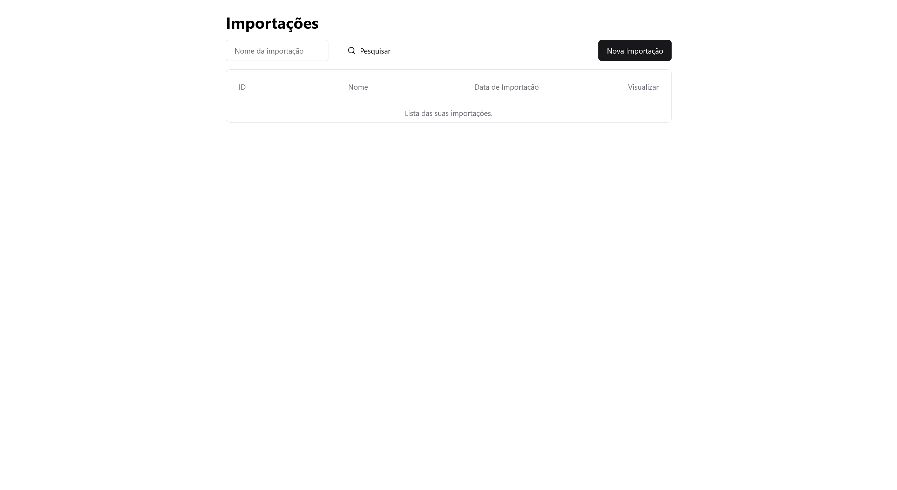

# 🌐 Projeto Citel Angular

## 📝 Descrição do Projeto

Este projeto é uma aplicação web desenvolvida utilizando o framework Angular. O objetivo do projeto é fornecer uma interface de usuário rica e interativa para visualização e manipulação de dados de doadores de sangue. A aplicação utiliza diversos componentes e bibliotecas para criar uma experiência de usuário fluida e responsiva.



## 🗂️ Estrutura do Projeto

A estrutura do projeto segue as melhores práticas recomendadas pelo Angular, organizando o código em módulos, componentes e serviços. Abaixo está uma visão geral da estrutura de diretórios:

citel-angular/  
├── src/   
│ ├── app/   
│ │ ├── components/   
│ │ ├── services/  
│ │ ├── models/  
│ │ ├── app.module.ts   
│ │ ├── app.component.ts   
│ │ └── app.component.html   
│ ├── assets/  
│ ├── environments/   
│ ├── index.html  
│ └── main.ts  
├── angular.json   
├── package.json  
└── README.md 

## 💻 Tecnologias Utilizadas

- **TypeScript 🟦**: Linguagem de programação que adiciona tipagem estática ao JavaScript.
- **JavaScript 🟨**: Linguagem de programação principal para desenvolvimento web.
- **NPM 📦**: Gerenciador de pacotes para JavaScript.
- **Angular 🔥**: Framework para construção de aplicações web de página única (SPA).

## 🚀 Benefícios do Angular

- **Produtividade 🔧**: Fornece uma estrutura robusta e bem definida para desenvolvimento de aplicações web, o que ajuda a aumentar a produtividade dos desenvolvedores.
- **Reatividade ⚡**: Utiliza o padrão de programação reativa para atualizar a interface do usuário de forma eficiente em resposta a eventos.
- **Componentização 🔄**: Promove a reutilização de código por meio de componentes, que podem ser facilmente compartilhados e integrados em diferentes partes da aplicação.
- **Ecossistema 🌍**: Possui um ecossistema rico de bibliotecas e ferramentas que facilitam o desenvolvimento de aplicações web complexas.
- **Comunidade 👥**: Possui uma comunidade ativa e engajada de desenvolvedores que contribuem com tutoriais, exemplos e plugins para aprimorar a experiência de desenvolvimento.
- **Performance 🚀**: Utiliza técnicas avançadas de otimização de desempenho para garantir que as aplicações sejam rápidas e responsivas.
- **Segurança 🛡️**: Possui recursos integrados para proteger as aplicações contra vulnerabilidades de segurança, como injeção de código malicioso e ataques de CSRF.

## 🎯 Padrões de Projeto Utilizados

### 🥇 Padrão Singleton

O padrão Singleton é utilizado para garantir que uma classe tenha apenas uma instância e fornecer um ponto global de acesso a essa instância. No contexto de uma aplicação Angular, o padrão Singleton é frequentemente utilizado em serviços.

#### 🔧 Exemplo de Código

Aqui está um exemplo de um serviço Angular implementado como um Singleton:

```typescript
import { Injectable } from '@angular/core';
import { HttpClient } from '@angular/common/http';
import { Observable } from 'rxjs';

@Injectable({
  providedIn: 'root'
})
export class ImportacaoService {
  private apiUrl = 'http://localhost:8080/importacoes';

  constructor(private http: HttpClient) {}

  getAllImportacoes(): Observable<any> {
    const url = `${this.apiUrl}`;
    return this.http.get(url);
  }

  uploadFile(file: File) {
    const formData = new FormData();
    formData.append('jsonFile', file, file.name);
    return this.http.post(this.apiUrl, formData, { responseType: 'text' });
  }
}
```

#### Explicação
@Injectable: O decorador @Injectable com a propriedade providedIn: 'root' garante que o serviço seja um Singleton. Isso significa que a mesma instância do serviço será compartilhada em toda a aplicação.
HttpClient: Utilizado para fazer requisições HTTP para a API backend.
Métodos getAllImportacoes e uploadFile: Estes métodos permitem armazenar e recuperar dados de forma centralizada, garantindo que todas as partes da aplicação acessem os mesmos dados.

###  🥸 Padrão Observer

O padrão Observer é utilizado para definir uma dependência um-para-muitos entre objetos, de modo que quando um objeto muda de estado, todos os seus dependentes são notificados e atualizados automaticamente. No contexto de uma aplicação Angular, o padrão Observer é frequentemente utilizado para atualizar a interface do usuário em resposta a eventos.

#### 🔧 Exemplo de Código

Aqui está um exemplo de um componente Angular implementado como um Observer:

```typescript
import {Component, OnInit} from '@angular/core';
import {ImportacaoService} from "../../service/importacao/importacao.service";
import {DialogImportacaoComponent} from "../../componentes/dialog-importacao/dialog-importacao.component";
import {TabelaImportacaoComponent} from "../../componentes/tabela-importacao/tabela-importacao.component";
import {
  FiltragemListaImportacaoComponent
} from "../../componentes/filtragem-lista-importacao/filtragem-lista-importacao.component";
import {DashboardComponent} from "../dashboard/dashboard.component";
import {RouterModule, RouterOutlet} from "@angular/router";

interface Invoice {
  id: number;
  nomeArquivo: string;
  dataImportacao: string;
}

@Component({
  selector: 'app-upload',
  standalone: true,
  imports: [DialogImportacaoComponent, TabelaImportacaoComponent, FiltragemListaImportacaoComponent, DashboardComponent, RouterOutlet, RouterModule],
  templateUrl: './upload.component.html'
})
export class UploadComponent implements OnInit {
  invoicesList: Invoice[] = []
  invoicesBackUp: Invoice[] = []

  constructor(private importacaoService: ImportacaoService) {
  }

  ngOnInit(): void {
    this.atualizarLista();
  }

  atualizarLista(): void {
    this.importacaoService.getAllImportacoes().subscribe((data) => {
      this.invoicesList = data.reverse();
    })
  }

  onUploadSucesso(): void {
    console.log("Upload bem-sucedido, atualizando lista de importações");
    this.atualizarLista();
  }

  aplicarFiltro(valorFiltro: string) {
   if (valorFiltro) {
      this.invoicesList = this.invoicesList.filter(d => d.nomeArquivo.toUpperCase().includes(valorFiltro.toUpperCase()));
    } else {
     this.atualizarLista()
   }
  }

}
```

#### Explicação

.ngOnInit(): O método ngOnInit é chamado automaticamente quando o componente é inicializado. Neste caso, ele chama o método atualizarLista para carregar os dados iniciais.

.atualizarLista(): Este método chama o serviço ImportacaoService para recuperar a lista de importações e atualiza a propriedade invoicesList.

.subscribe(): O método subscribe é usado para se inscrever a um Observable e receber notificações quando os dados são retornados do servidor.

## 🏁 Conclusão

Este projeto demonstra como utilizar o Angular para desenvolver uma aplicação web interativa e responsiva para visualização e manipulação de dados de doadores de sangue. Utilizando padrões de projeto como Singleton e Observer, a aplicação garante uma arquitetura robusta e escalável. Além disso, o uso de tecnologias modernas como TypeScript, RxJS e Angular CLI facilita o desenvolvimento, manutenção e expansão da aplicação. A comunidade ativa e o suporte contínuo do Angular asseguram que a aplicação se mantenha atualizada e segura.

## ✅ Pré-requisitos

Antes de começar, as seguintes ferramentas devem estar instaladas em sua máquina:

- 🐳 Docker

## 🚀 Como Rodar o Aplicativo

Antes de executar o front-end, é necessário executar o [back-end](https://github.com/JoaaoM/citel-back-end). Siga estas etapas para executar o aplicativo em sua máquina local:

1. Clone este repositório: `git clone https://github.com/JoaaoM/citel-angular`
2. Certifique-se de que o Docker Desktop está instalado e em execução em sua máquina
3. Navegue até o diretório do projeto: `cd citel-angular`
4. Inicie o aplicativo executando o comando: `docker-compose up -d --build`.
5. Acesse o aplicativo através do link `http://localhost:4200/upload` em seu navegador.
6. Para parar o aplicativo e liberar recursos, execute o comando: `docker-compose down`.

Certifique-se de seguir essas etapas na ordem correta para garantir o funcionamento correto do aplicativo.


## 👤 Autor

João Marques Oliveira
